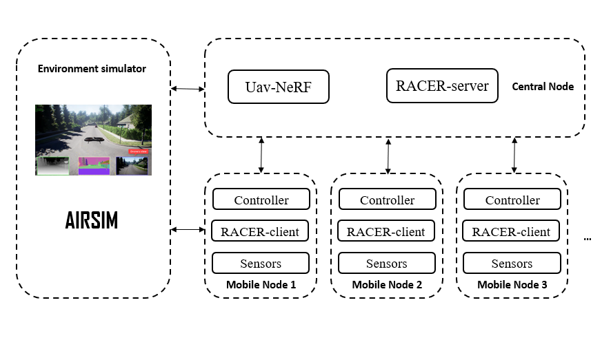

# 多无人机协同的高效三维重建系统（仿真系统）
> Developer:
> Chen Xiangyi(chen-xy19@mails.tsinghua.edu.cn), Yang Ding, Wang Jue    
> *Update Time：2023-04-14*
---

## 系统架构

## 环境准备
1. 配置Airsim ROS Package。按照[AirSim ROS Package说明文档](https://microsoft.github.io/AirSim/airsim_ros_pkgs/)进行配置，为了保证后续步骤正常进行，请确保在`~\.bashrc`中含有对Airsim ROS Package所处环境的source步骤。
2. 安装foxglove-bridge
```
sudo apt install ros-$ROS_DISTRO-foxglove-bridge
```
$ROS_DISTRO是您使用的ROS Version。  

  3. 克隆uav-nerf-sim并编译
```
git clone https://github.com/ClearmanChen/uav-nerf-sim.git
cd uav-nerf-sim
catkin_make
```


## 快速入门
1. 启动Unreal Engine with AirSim。AirSim是内嵌于UE环境的飞行器环境仿真插件。可以采用[二进制预编译包](https://microsoft.github.io/AirSim/use_precompiled/)来启动该环境。注意，Airsim配置文件需要指定为`settings\settings.json`。以地图`Block`为例。
```
cd $PATH_TO_BIN$
bash Blocks.sh
```

2. 使用roslaunch快速启动ROS软件包,通常包括 Airsim ROS Wrapper, Uav Controller, RACER等。
```
cd $PATH_TO_UAV_NERF_SIM$\launch
roslaunch start_simulation.launch
```

- **ROS Wrapper** 可以将UE环境中无人机的各种参数、状态信息收集并封装为ROS话题，在ROS系统中发布，起到了信息映射作用。
- **Uav Controller** 移动节点的控制包。负责接受外部指令并调用接口控制无人机行动。

3. 启动Foxglove可视化工具，配置文件指定为`settings\foxglove_default.json`。
## ROS API/Parameter 说明
以ROS节点为单位介绍核心的参数和话题接口。

### ROS Wrapper
#### **Topic**
- **/airsim_node/uav{drone_id}/odom_local_enu** 发布话题，无人机里程计，ENU坐标系。
- **/airsim_node/uav{drone_id}/uav{drone_id}_depth_camera/DepthPlanar** 发布话题，无人机深度相机深度图片。
- **/airsim_node/uav{drone_id}/uav{drone_id}_depth_camera/DepthPlanar/camera_info** 发布话题，无人机深度相机参数。
- **/airsim_node/uav{drone_id}/lidar/Lidar2** 发布话题，无人机点云信息。

### uav_controller.py
#### **参数**
- **drone_id** 无人机编号。
- **if_planner_enabled** 是否使用局部规划器。否则调用airsim接口代替。
#### **Topic**
- **/uav_controller_node_uav{uav_index}/trigger** 订阅话题，要求输入String。'TAKEOFF'使无人机起飞，'LANDI'使无人机降落。
- **/uav_controller_node_uav{uav_index}/state** 发布话题，输出String。'TAKEOFF'无人机正在起飞，'LANDING'无人机正在降落，'WAITINGTARGET'无人机已经起飞且正在等待目标，'ONWAY'无人机已经起飞并正在前往目标，'STANDBY'无人机未起飞。

## TODO
1. RACER框架中对simulation的模块进行替换，替换为airsim架构。
2. 系统需要定义“到达目标点”的状态，并调用airsim接口向nerf传输图像。
3. 移动节点需要告知中心节点摄像机位姿，中心节点接受后需要转换为三维重建算法所需的json格式。
## 需要注意的问题
- 某些情况下启动Airsim时，会出现“核心已转储”的报错，这多数与内存访问错误相关。可以再次尝试启动，错误一般会消失。
- 在尝试打印从airsim中获取的参数时，有概率出现“核心已转储”。需要手动检查哪一个变量的打印引发的错误。该错误暂时没找到解决方案。