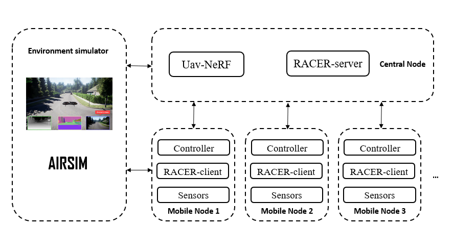

# 多无人机协同的高效三维重建系统（仿真系统）
> Developer:
> Chen Xiangyi(chen-xy19@mails.tsinghua.edu.cn), Yang Ding, Wang Jue    
> *Update Time：2023-03-22*
---

## 系统架构

## 环境准备
1. 启动AirSim环境。AirSim是内嵌于UE环境的飞行器环境仿真插件。可以采用[二进制预编译包](https://microsoft.github.io/AirSim/use_precompiled/)来启动该环境，以地图`Block`为例。
```
cd $PATH_TO_BIN$
bash Blocks.sh
```
2. 克隆uav-nerf-sim并编译
```
git clone https://git.tsinghua.edu.cn/chen-xy19/uav-nerf-sim.git
cd uav-nerf-sim
catkin_make
```
3. 启动ROS软件包。
ROS软件包包括 Airsim ROS Wrapper, Uav Controller, Uav Communication, 导航模块Ego planner等。这些模块被集成在`src/launch/airsim_no_px4.launch`中，可以简单地通过`roslaunch src/launch/airsim_no_px4.launch`来启动它们。

- **ROS Wrapper** 可以将UE环境中无人机的各种参数、状态信息收集并封装为ROS话题，在ROS系统中发布，起到了信息映射作用。
- **Uav Controller** 移动节点的控制包。负责接受外部指令并调用接口控制无人机行动。

## ROS API/Parameter 说明
以ROS节点为单位介绍核心的参数和话题接口。

### ROS Wrapper
#### **Topic**
- **/airsim_node/uav{drone_id}/odom_local_enu** 发布话题，无人机里程计，ENU坐标系。
- **/airsim_node/uav{drone_id}/uav{drone_id}_depth_camera/DepthPlanar** 发布话题，无人机深度相机深度图片。
- **/airsim_node/uav{drone_id}/uav{drone_id}_depth_camera/DepthPlanar/camera_info** 发布话题，无人机深度相机参数。
- **/airsim_node/uav{drone_id}/lidar/Lidar2** 发布话题，无人机深度相机参数。

### uav_controller.py
#### **参数**
- **drone_id** 无人机编号。
- **if_planner_enabled** 是否使用局部规划器。否则调用airsim接口代替。
#### **Topic**
- **/uav_controller_node_uav{uav_index}/trigger** 订阅话题，要求输入String。'TAKEOFF'使无人机起飞，'LANDI'使无人机降落。
- **/uav_controller_node_uav{uav_index}/state** 发布话题，输出String。'TAKEOFF'无人机正在起飞，'LANDING'无人机正在降落，'WAITINGTARGET'无人机已经起飞且正在等待目标，'ONWAY'无人机已经起飞并正在前往目标，'STANDBY'无人机未起飞。

## TODO
1. 局部规划器可能需要更换。目前ego planner在仿真环境中会出现碰撞障碍物、不能精确到达位置。这很可能是因为坐标系不一致引起的，需要进一步调试。
2. 中央节点通讯模块需要加入多线程，以同时接受多个客户端的连接。
3. 中央节点还需要向移动节点发布指令，因此需要写中心节点的发布功能、移动节点的接收功能等模块。
4. 移动节点的控制节点中，对“是否到达目标点”的判定不够精确，会导致无人机在摇晃的过程中拍照。考虑修正阈值。
5. 移动节点需要告知中心节点摄像机位姿，中心节点接受后需要转换为三维重建算法所需的json格式。
6. 移动节点提取当前位姿应该使用传感器估计值，目前使用真实值。
7. 现在无人机的目标点信息输入话题是`/ego_planner_node_uav0/target_input`，应该把它移动到`uav_controller_node`下，这样才符合设计的逻辑。
8. main_controller这个包的设计后面应该移动到中心节点。中心节点应该设计一个无人机控制类，封装所有对无人机的操作接口。
9. 完善通讯节点接口，包括 `/uav_communication_client_uav{uav_index}/photo_trigger` 订阅话题的处理。
10. 从通讯节点接收到拍照指令到开始通讯中间耗时长，需要排查具体原因：Airsim仿真环境响应时间过长。多线程并发较大。
11. 移动节点的通讯模块中，如果未连接成功中心节点，则阻塞并继续尝试连接。
## 需要注意的问题
- 某些情况下启动Airsim时，会出现“核心已转储”的报错，这多数与内存访问错误相关。可以再次尝试启动，错误一般会消失。
- 在尝试打印从airsim中获取的参数时，有概率出现“核心已转储”。需要手动检查哪一个变量的打印引发的错误。该错误暂时没找到解决方案。
- 必须要先启动中央节点通讯服务，再启动移动节点通讯服务，否则出错。在完成TODO 11后可以解决。